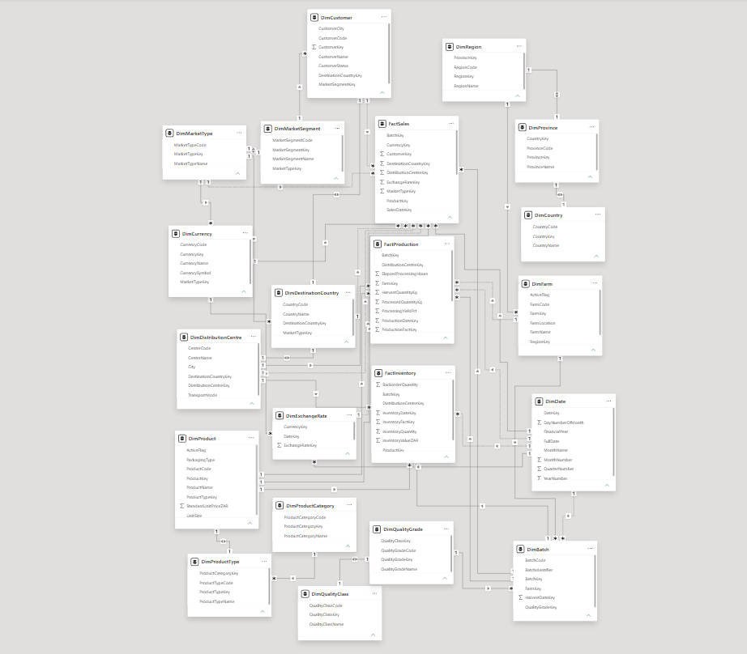

# RooiTea Data Warehouse & BI Analytics Platform

## 📌 Project Overview
An end-to-end Enterprise Data Warehouse (EDW) and Business Intelligence solution engineered for a fictional Rooibos tea manufacturing and distribution company. This project transforms raw operational data (Harvesting, Processing, Sales, and Inventory) into a structured Star Schema to provide actionable insights for C-Suite executives and supply chain managers.

## 🛠️ Technology Stack
* **Database Engine:** SQL Server (T-SQL, Stored Procedures, Views)
* **ETL Pipeline:** SQL Server Integration Services (SSIS)
* **Data Modeling:** Dimensional Modeling (Star Schema)
* **Business Intelligence:** Power BI (DAX, Interactive Dashboards)
* **Version Control:** Git & GitHub

## 🏗️ Architecture & Data Pipeline
The data pipeline was engineered to handle millions of rows with high data integrity.

1. **Extraction:** Raw data is extracted from the `RooiTea_Operational` database.
2. **Transformation (ELT):** Data is staged and transformed using SSIS. Key transformations include:
   * Logical imputation of missing geographic data using SQL `CASE` statements.
   * Surrogate key generation for robust dimension linking.
3. **Loading:** Transformed data is loaded into the `RooiTea_DW` Star Schema.

## 📊 Business Intelligence Dashboard
The Power BI dashboard features 4 distinct analytical views. *(Note: The interactive `.pbix` file is available in the repository. A static PDF overview is available in the Documentation folder).*

### 1. Executive Overview
Focuses on macro-level KPIs (Total Revenue, Inventory Value) and global sales footprints.

### 2. Sales Analytics
Drills down into market demographics, chronological revenue seasonality, and detailed product performance using conditionally formatted matrices.

### 3. Production & Yield Analytics
Tracks the efficiency of the factory line, processing hours, and harvest volumes across 8 supply farms.

## 🧠 Key Challenges & Solutions Overcome
* **Ambiguous Filtering Paths:** Resolved complex circular relationships in Power BI between bridging dimensions (`DimBatch`) and time-intelligence tables (`DimDate`) by strategically managing active/inactive paths, ensuring accurate time-series calculations across 6 years of data.
* **Data Cleansing at Scale:** Engineered robust SSIS data flows to handle null values and mismatched data types between the source system and the warehouse.

## 📁 Repository Structure
* `/1_Database_Scripts`: T-SQL scripts for DDL and DML operations.
* `/2_SSIS_ETL`: Visual Studio integration packages.
* `/3_PowerBI_Dashboard`: The interactive dashboard file.
* `/4_Documentation`: System architecture and manual PDFs.